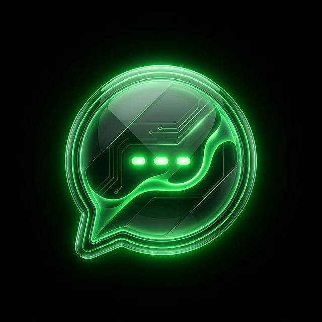

<div align="center">
  
  <h1>ChatGrid</h1>
  <p><em>A bleeding-edge, real-time chat application with a stunning dark-neon aesthetic.</em></p>
</div>

---

Hey everyone! 👋 

Welcome to **ChatGrid**. I built this project because I wanted a chatting experience that didn't just work flawlessly behind the scenes but also looked absolutely incredible on the surface. Forget the boring, flat UI designs—ChatGrid is built with a custom **"liquid-glass"** aesthetic: pure true-black backgrounds, vibrant neon-green glows, floating elements, and smooth micro-animations that make the app feel alive.

It's a full-stack MERN application with real-time bidirectional communication. Whether you're sending texts or sharing images, everything updates instantly without a single page reload.

## ✨ Why ChatGrid?

I completely ripped out standard UI component libraries to build a custom CSS design system from the ground up. You’ll notice:
- **Glassmorphic UI**: Frosted glass sidebars, liquid-glass cards, and blurred overlays.
- **Silky Smooth Animations**: Message bubbles slide in gracefully, loaders pulse with neon glows, and background mesh gradients shift naturally in the background.
- **Zero-Compromise Dark Mode**: Built primarily for the dark mode lovers (but fully supports a classic light mode if you're into that).

## 🚀 Features

- **Real-Time Messaging**: Powered by Socket.io for instant message delivery and "user is online" indicators.
- **Secure Authentication**: JWT-based auth via HTTP-only cookies. No messy local storage tokens!
- **Image Sharing**: Send pictures directly in the chat, seamlessly uploaded and optimized via Cloudinary.
- **Global State Management**: Blazing fast frontend state powered by Zustand.
- **Fully Responsive**: Looks just as good on a mobile browser as it does on a widescreen desktop.

## 💻 Tech Stack

**Frontend:**
- React 19 + Vite
- Zustand (State Management)
- React Router DOM
- Axios
- Custom CSS Variables (Zero bulky UI libraries!)
- Lucide React (Icons)

**Backend:**
- Node.js & Express.js
- MongoDB w/ Mongoose
- Socket.io (WebSockets)
- JSON Web Tokens (JWT) & bcryptjs
- Cloudinary (Image handling)

## 🛠️ Getting Started (Local Development)

If you want to spin this up locally and hack around, it's pretty straightforward.

### 1. Clone the repo
```bash
git clone https://github.com/yourusername/fullstack-chat-app.git
cd fullstack-chat-app
```

### 2. Install dependencies
You'll need to install packages for both the backend and frontend:
```bash
npm run build
# Or manually:
# cd backend && npm install
# cd frontend && npm install
```

### 3. Setup Environment Variables
Create a `.env` file inside the `/backend` folder. You'll need to provide your own keys here:

```env
PORT=5001
MONGODB_URI=your_mongodb_connection_string
JWT_SECRET=your_super_secret_jwt_key
NODE_ENV=development

# Cloudinary Setup
CLOUDINARY_CLOUD_NAME=your_cloud_name
CLOUDINARY_API_KEY=your_api_key
CLOUDINARY_API_SECRET=your_api_secret
```

### 4. Run the app!
I recommend running two terminal instances, one for the frontend and one for the backend.

**Terminal 1 (Backend):**
```bash
cd backend
npm run dev
```

**Terminal 2 (Frontend):**
```bash
cd frontend
npm run dev
```

The app will now be available at `http://localhost:5173`. Fire it up, create an account, and start chatting!

---

## 🤝 Contributing
I'm extremely proud of the design and architecture of this app, but there's always room for improvement! If you spot a bug, want to add typing indicators, or have an idea to make the animations even smoother, feel free to open a PR. 

Thanks for dropping by, and happy coding! 💚
